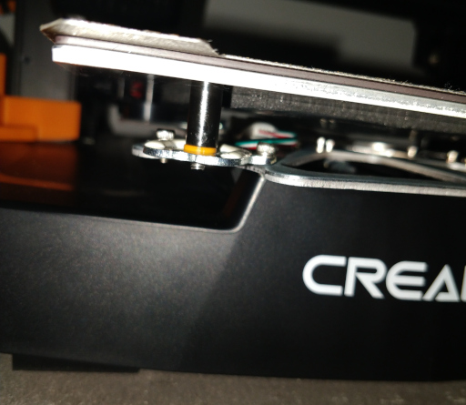
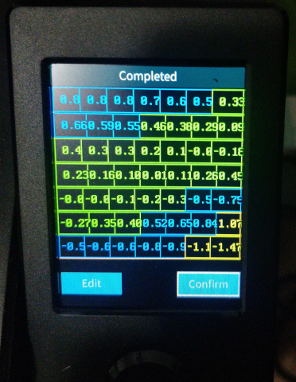
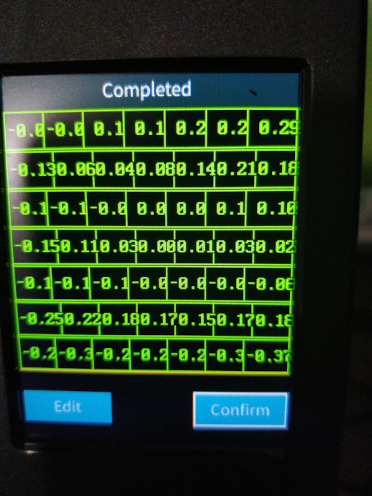

# Bed level spacers

|Before|After|
|---|---|
|  |  |

## 3mf files used

* [0.6MM shim](./ender3v3se_shim_0,6mm.3mf)
* [1.0MM shim](./ender3v3se_shim_1mm.3mf)

### source

* [https://www.printables.com/model/733411-ender-3-v3-seke-bed-leveling-shims](https://www.printables.com/model/733411-ender-3-v3-seke-bed-leveling-shims)
