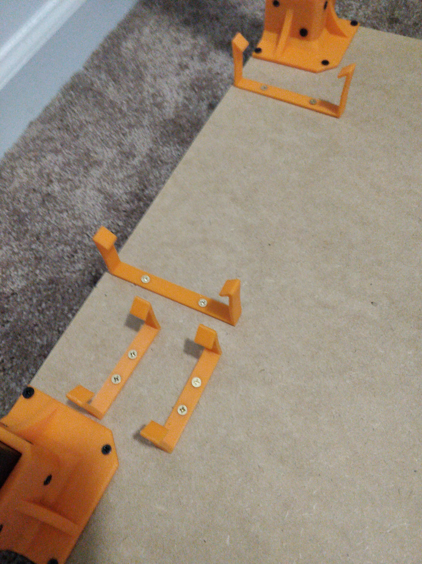

# OpenSCAD mounting brackets

Created for a Cyberpower HT1208TC surge protector and a Flirc Raspberry Pi 4 case

![holding stuff]./(brackets-2.jpg)

## STLs

* [Bracket for Flirc case](./rpi4-flirc-case.stl) X 2
* [Bracket for Cyberpower surge protector](./cyberpower.stl) X 2

## OpenSCAD files

* [OpenSCAD file](./customizable-box-psu-power-adapter-holder.scad)
* [OpenSCAD bracket configs](./customizable-box-psu-power-adapter-holder.json)

### Source

* [https://www.thingiverse.com/thing:6490337](https://www.thingiverse.com/thing:6490337)
