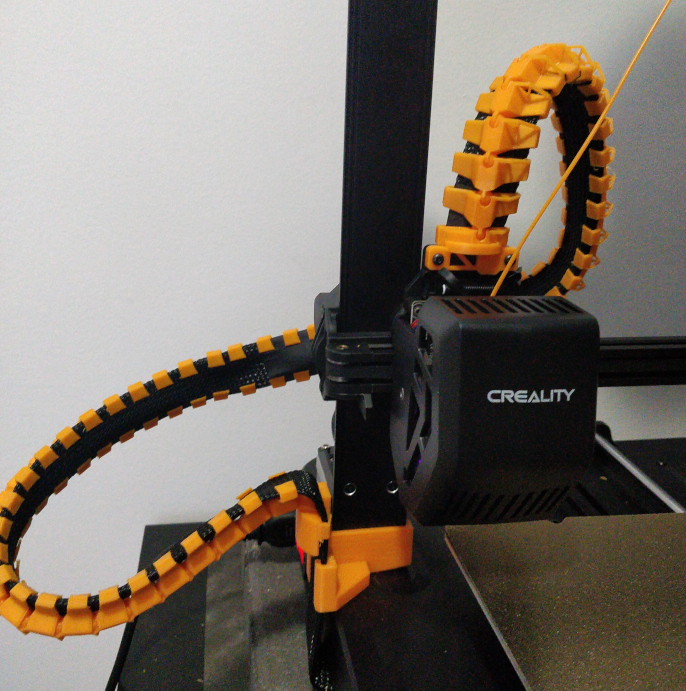
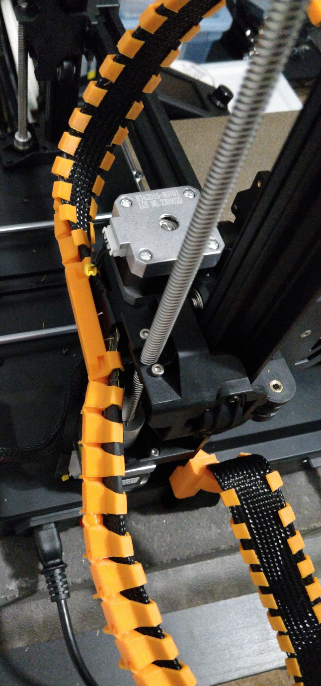

# Spine chain cable for Ender 3 V3 SE

## STLs

* [base](./spine-cable-base.stl)
* [chain link](./spine-cable-chain.stl) X 48
* [support link](./spine-cable-chain-support-link.stl)
* [end clamp](./spine-chain-clamp.stl)

### NOTES

Used M3x8 screws to secure clamp into place.

## Sources

    * https://www.printables.com/model/695436-ender-3-v3-se-spine-cable-chain
    * https://www.printables.com/model/849353-ender-3-v3-se-spine-cable-chain-base
    * https://www.printables.com/model/754240-ender-3-v3-se-spine-cable-chain-support-link
    * https://www.printables.com/model/754271-ender-3-v3-se-spine-cable-clamp-to-spine/
